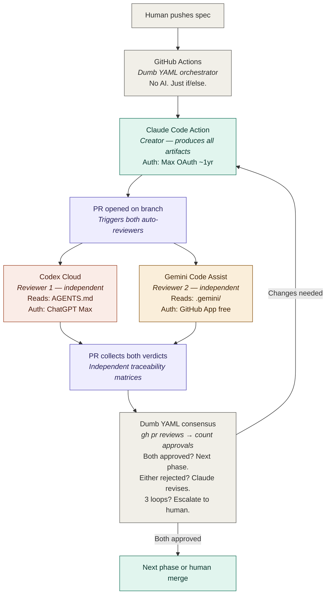
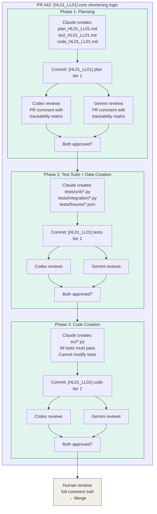
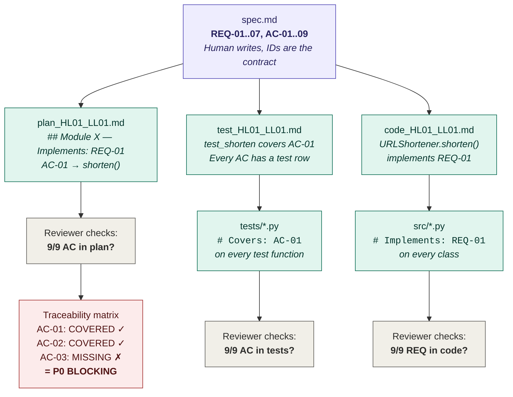
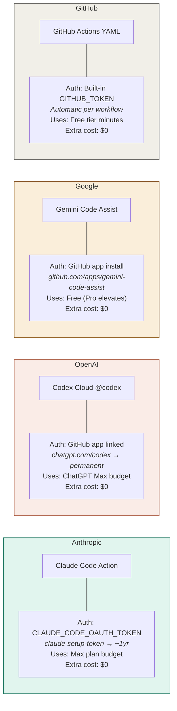
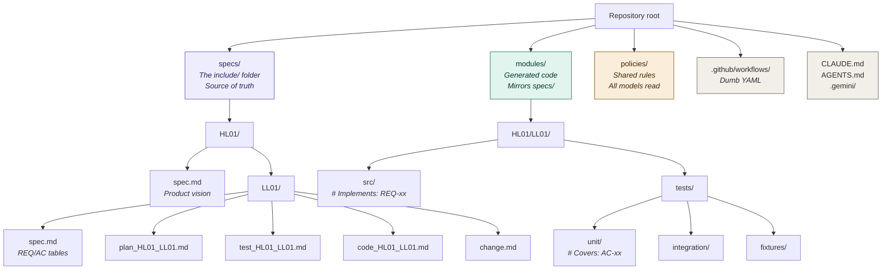
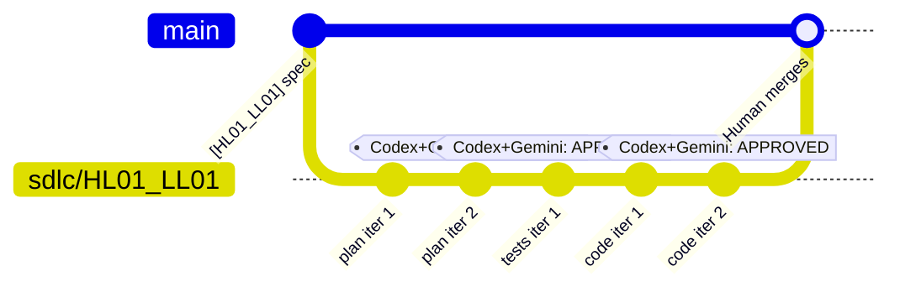

# Architecture diagrams

All diagrams render natively on GitHub via Mermaid.

---

## Diagram 1: Zero-trust three-model architecture



### Zero-trust principles

1. No LLM is privileged — Claude creates, Codex reviews, Gemini reviews, none decide what happens next
2. No LLM reads another LLM's output directly — they all read the same specs, code, PR diff
3. Each model has its OWN context file — CLAUDE.md, AGENTS.md, .gemini/styleguide.md
4. The orchestrator has no opinion — it counts approvals, nothing more
5. Disagreement escalates to human — no LLM overrules another

---

## Diagram 2: Single PR, three phases



### What the PR contains when done

- **Commits**: plan iter 1..N, tests iter 1..N, code iter 1..N
- **Comments**: Codex reviews + Gemini reviews per phase, each with traceability matrix
- **Files**: plan.md, test.md, code.md, tests/, src/, fixtures/
- **Title**: [HL01_LL01] core shortening logic — always maps to spec

---

## Diagram 3: Traceability chain (no lost in translation)



### How IDs prevent lost in translation

Every `AC-xx` must appear at every level. If a reviewer can `grep -r "AC-03"` and find it in the spec but not in the tests — that is an instant P0 blocking issue. No interpretation needed. Machine-verifiable.

---

## Diagram 4: Auth model — zero API keys, zero extra bills



### Why not API keys

| API key | What it does | The catch |
|---------|-------------|-----------|
| `OPENAI_API_KEY` | Powers `openai/codex-action` on GH runners | Separate bill from ChatGPT Max. Per-token charges. |
| `GEMINI_API_KEY` | Powers Gemini API calls from AI Studio | Completely separate product from Google AI Pro. Different billing account. |
| `ANTHROPIC_API_KEY` | Powers Claude API calls | Separate from Claude Max. Per-token charges. |

We avoid ALL of these. Every tool runs on its subscription. No surprises.

---

## Diagram 5: Folder structure



### The mirror principle

`specs/HL01/LL01/spec.md` defines the contract.
`modules/HL01/LL01/src/` implements it.
Same path structure. Specs are the `.hpp`, modules are the `.cpp`.

---

## Diagram 6: PR anatomy (what a completed feature looks like)



### PR comment trail

```
#1  codex-cloud[bot]       Phase 1: AC-03 missing. CHANGES_NEEDED
#2  gemini-code-assist     Phase 1: AC-09 not addressed. CHANGES_NEEDED
#3  codex-cloud[bot]       Phase 1 re-review: 9/9 AC. APPROVED
#4  gemini-code-assist     Phase 1 re-review: APPROVED
#5  codex-cloud[bot]       Phase 2: APPROVED
#6  gemini-code-assist     Phase 2: APPROVED
#7  codex-cloud[bot]       Phase 3: tests green, 9/9 AC. APPROVED
#8  gemini-code-assist     Phase 3: APPROVED
#9  human                  LGTM. Merging.
```

One PR. One feature. Complete audit trail.

